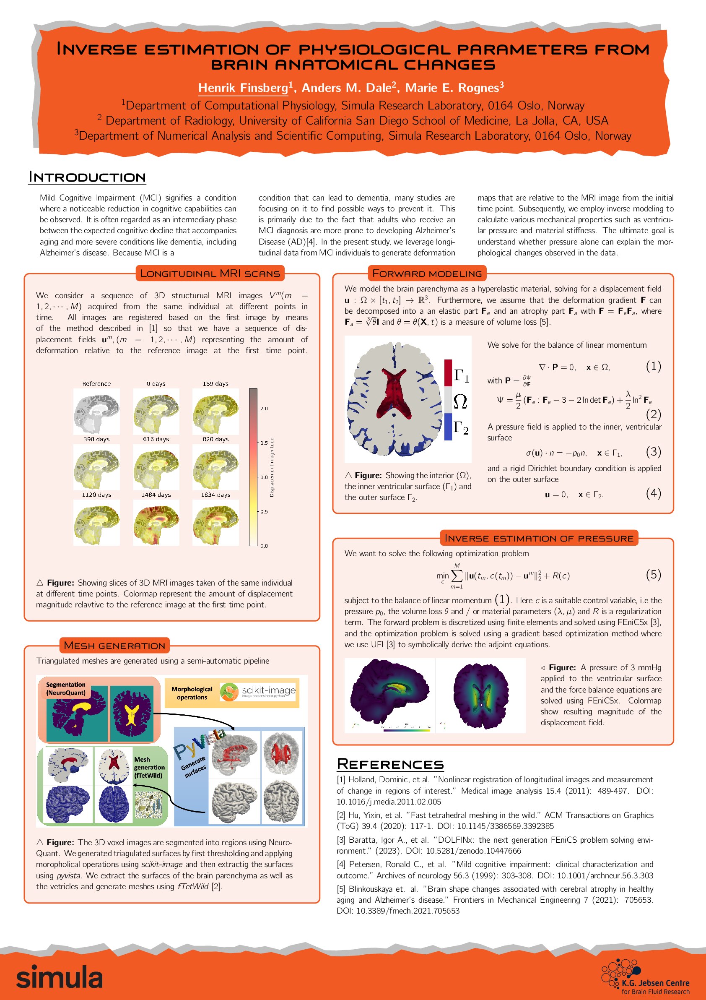

# MPS motion poster 
Source code for poster shown at the [Geilo Winter School 2025](https://www.sintef.no/projectweb/geilowinterschool/2025-inverse-problems/).

Compile the pdf using 
```
pdflatex main.tex
pdflatex main.tex
```
You can also use the provided GitHub workflow which will upload the pdf as an artifact

Here is a screenshot of the poster

